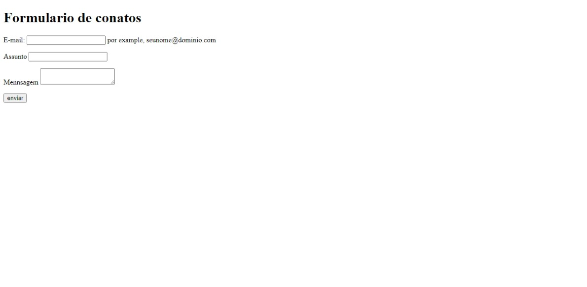
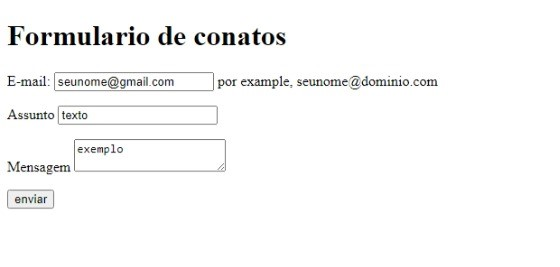

# formi-contatos 🧑‍💻 

# descrição do produto
* Fizemos um site para vc falar sobres os bug e tirar suas duvidas do site que eu fiz.  

# ferramentas utilizadas ⚙️
* VSCODE 🔗
* CSS3 🔗
* HTML 🔗

# funcionalidade 👨‍💻
* a funcionalidade do meu site e ajudar as pessoas que quer tirar suas duvidas do site ou que aconteceu um bug. 

um exemplo e como que vai quando você for fazer no seu site!

# Autores 📝
* profº leo, comunicou o que era pra fazer
* eu guilherme

# Elemontos utilizados 
* FORM: O elemento HTML <form> representa uma seção de documento que contém controles interativos para enviar informações.
* LABEL: O elemento HTML <label> representa uma legenda para um item em uma interface do usuário.
* INPUT:O elemento HTML <input> é usado para criar controles interativos para formulários baseados na Web, a fim de aceitar dados do usuário; Uma grande variedade de tipos de dados de entrada e widgets de controle estão disponíveis, dependendo do dispositivo e do agente do usuário.
* SPAN : Ele deve ser usado somente quando nenhum outro elemento semântico é apropriado. é muito parecido com um elemento 
 mas 
 é um elemento de nível de bloco, enquanto a é um elemento de nível embutido.

# fontes que utilizei 📖
<a href ="https://emojiterra.com/memo/">EMOJITERRA</a>
<a href ="https://www.alura.com.br/artigos/escrever-bom-readme">COMO ESCREVER UM BOM REAMDE</a>
<a href ="https://developer.mozilla.org/en-US/docs/Web/HTML/Element/form">COMO ESCREVER UM BOM README</a>

